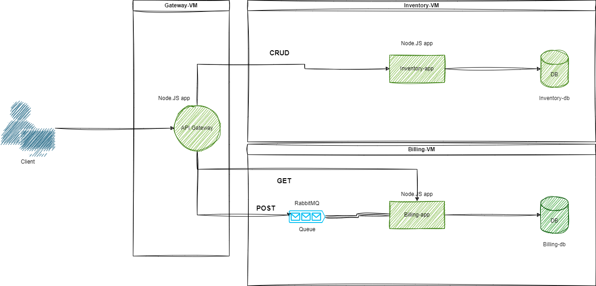

<!-- ctrl + shift + v to preview -->
# vagrant-microservice-architecture

## General Information




## Features
- Microservice architecture
- Automatic infrastrcture provisioning with Vagrant & VirtualBox
- Message queue system

## Technologies Used

[VirtualBox](https://www.virtualbox.org/)

[Vagrant](https://www.vagrantup.com/)

[Node.js](https://nodejs.org/en)

[PostgreSQL](https://www.postgresql.org/)

[RabbitMQ](https://www.rabbitmq.com/)


## Main Learnings
- Infrastrcture provisioning using Vagrant
- Basic microservice architecture
- API Gateway
- Basics of hypervisors
- Basics of a message queue system
- Basics of PostgreSQL
- Bash scripting

## Setup
Clone the repository
```
git clone https://01.kood.tech/git/gkoridze/crud-master
```
Install VirtualBox
```
sudo apt install virtualbox
```

Install vagrant
```
sudo apt install vagrant
```

Rename .env-example to .env

Deploy the microservices
```
vagrant up --provider virtualbox
```
